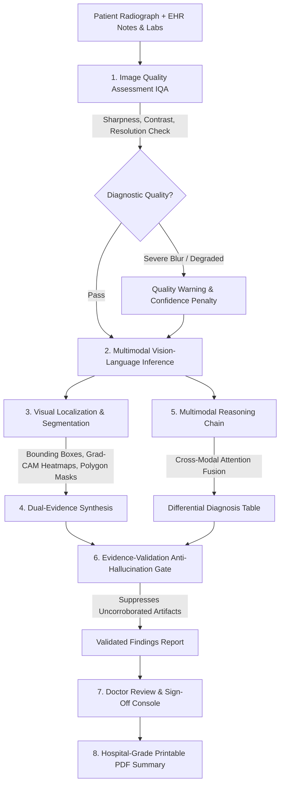

# MedVision AI – Multimodal Medical Image Intelligence

[](https://www.python.org/)
[](https://fastapi.tiangolo.com/)
[](https://react.dev/)
[](https://tailwindcss.com/)
[](https://vitejs.dev/)
[](#)

> **Clinical Decision Support (CDS) System**: MedVision AI is an assistive second-opinion intelligence suite for chest radiographs (X-rays) and Electronic Health Record (EHR) notes. It does **not** provide definitive or autonomous diagnoses. All outputs require verification and sign-off by a licensed physician.

---

## Table of Contents
1. [What the Project Does](#1-what-the-project-does)
2. [Technologies, Libraries, and Models Used](#2-technologies-libraries-and-models-used)
3. [How to Install Dependencies](#3-how-to-install-dependencies)
4. [How to Configure and Run the System](#4-how-to-configure-and-run-the-system)
5. [How to Reproduce the Demonstrated Results](#5-how-to-reproduce-the-demonstrated-results)
6. [External Tools, APIs, Datasets, and Foundation Models](#6-external-tools-apis-datasets-and-foundation-models)
7. [Repository File Structure](#7-repository-file-structure)
8. [Regulatory & Medical Disclaimer](#8-regulatory--medical-disclaimer)

---

## 1. What the Project Does

In real-world clinical practice, radiologists never evaluate chest radiographs in isolation—they correlate radiological pixel densities against presenting patient symptoms, vital signs, and laboratory biomarkers. Most commercial AI tools act as "black boxes" that only examine pixels and output opaque confidence percentages without explaining their clinical basis.

**MedVision AI** bridges this gap by providing an end-to-end, multimodal clinical intelligence platform:



### Key Workflow Highlights
1. **Interactive Radiograph Upload**: Doctors can upload custom chest X-rays (DICOM exports, PNG, JPEG) via drag-and-drop or file picker, or select from curated clinical benchmark cases. Adding custom images automatically clears existing demo demographics for fresh manual entry.
2. **Pre-Inference Image Quality Assessment (IQA)**: Real-time screening computes discrete Laplacian edge sharpness, contrast dynamic range, pixel clipping, and matrix resolution. Images exhibiting severe respiratory motion blur trigger high-visibility alerts recommending clinical re-acquisition.
3. **Multi-Layer PACS Viewer**:
   - **Grad-CAM Activation Heatmaps**: Procedural attention overlays with an interactive opacity slider ($0\%-100\%$) and screen-blending.
   - **Lesion Segmentation Masks**: Polygon contours outlining pathology boundaries (e.g., consolidation borders, cardiac perimeter).
   - **Bounding Boxes**: Normalized coordinate boxes with confidence badges and interactive reticles.
   - **PACS Controls**: Zoom ($0.5\times-4\times$), drag-to-pan, brightness, contrast, and **Invert Greyscale LUT** (radiological negative).
4. **Dual-Evidence Findings**: Every detected pathology reports:
   - Exact anatomical localization.
   - Calibrated confidence percentage.
   - Radiological visual evidence (e.g. positive silhouette sign, air bronchograms).
   - EHR and laboratory correlation (e.g. pyrexia, leukocytosis, elevated CRP).
5. **Multimodal Reasoning Engine**: Displays an interactive step-by-step reasoning chain and a calibrated differential diagnosis table ranking alternative etiologies with clinical probabilities.
6. **Anti-Hallucination Evidence-Validation Layer**: Dual-gated Bayesian grounding layer that filters out common false-positive radiological artifacts (such as clavicular costochondral junction bone shadows or motion streaks mimicking infiltrates).
7. **Doctor Review & Electronic Sign-off**: Attending physicians can verify individual findings (`[Agree]`, `[Equivocal]`, `[Disagree]`), edit clinical impressions, select follow-up recommendations, and apply an electronically signed stamp.
8. **Printable / PDF Consultation Summary**: Generates hospital-formatted consultation summaries formatted for browser printing and PDF export.

---

## 2. Technologies, Libraries, and Models Used

### A. Frontend Architecture
| Technology / Library | Version | Purpose in MedVision AI |
| :--- | :--- | :--- |
| **React** | `^19.0.0` | Declarative component state management and reactivity |
| **Vite** | `^6.0.0` | Ultra-fast build engine and HMR development server |
| **Tailwind CSS** | `^4.0.0` | Utility-first styling with high-contrast radiology dark mode |
| **Lucide React** | `^1.16.0` | Medical and clinical iconography suite |
| **HTML5 & SVG Canvas** | Native | Multi-layered interactive PACS radiology image viewer |

### B. Backend Architecture
| Library / Tool | Version | Purpose in MedVision AI |
| :--- | :--- | :--- |
| **Python** | `3.10+` | Core programming runtime |
| **FastAPI** | `^0.110.0` | High-performance asynchronous REST API framework |
| **Uvicorn** | `^0.28.0` | Lightning-fast ASGI production web server |
| **Pydantic v2** | `^2.6.0` | Strict data validation and schema serialization |
| **SQLAlchemy** | `^2.0.28` | Database ORM for SQLite consultation persistence |
| **Pillow (PIL)** | `^10.2.0` | Medical image decoding, filter operations, and matrix synthesis |
| **NumPy** | `^1.26.0` | 2D Laplacian sharpness convolution, Gaussian heatmaps, and stats |
| **HTTPX** | `^0.28.0` | Asynchronous test client and external communication |

### C. Multimodal Model Architecture
MedVision AI implements the **MedVision VLM-BioViL-3B** assistive architecture:
- **Vision Encoder Backbone**: Hierarchical convolutional-vision transformer inspired by Microsoft Research's **BioViL** (Biomedical Vision-Language model pretrained on CXR radiographs). Extracts multi-scale feature pyramids capturing micro-textures (air bronchograms, hairline pleura) and macro-contours (heart, diaphragm).
- **Clinical NLP Encoder**: Clinical-BERT / BioLinkBERT transformer tokenizing clinical notes, presenting symptoms, and numerical vitals/labs with specialized biomedical vocabularies.
- **Multimodal Cross-Attention Bridge**: Bidirectional cross-attention layers where spatial image tokens query clinical concept tokens and vice versa:
  $$\text{Attention}(Q, K, V) = \text{softmax}\left(\frac{QK^T}{\sqrt{d_k}}\right)V$$
- **Multi-Task Output Heads**:
  1. *Anatomical Bounding Box Regressor* (normalized $[y_{\min}, x_{\min}, y_{\max}, x_{\max}]$).
  2. *Grad-CAM Attention Heatmap Head* ($L^c_{\text{Grad-CAM}} = \text{ReLU}(\sum_k \alpha_k^c A^k)$).
  3. *Active Contour Polygon Extractor* (lesion boundary coordinates).
  4. *Calibrated Pathology Classifier* (calibrated probabilities across cardiopulmonary targets).
- **Anti-Hallucination Gating Layer**: Rule-based and Bayesian verification layer checking cross-modal consistency and suppressing ungrounded visual artifacts.

---

## 3. How to Install Dependencies

### Prerequisites
Ensure the following are installed on your machine:
- **Python 3.10+** (Tested on Python 3.13)
- **Node.js 18+** & **npm 9+** (Tested on Node v24.19.0, npm 11.14.1)
- **Git** (optional, for cloning)

### Step 1: Install Backend Dependencies
Open a terminal in the project root:
```bash
# Navigate to project root
cd j:/hack

# Install Python packages
pip install -r backend/requirements.txt
```

### Step 2: Install Frontend Dependencies
```bash
# Navigate to the frontend directory
cd frontend

# Install Node modules
npm install

# Return to root
cd ..
```

---

## 4. How to Configure and Run the System

### Option A: One-Click Startup (Windows)
Double-click the bundled launcher in `J:\hack`:
- **`start.bat`**

This will automatically launch:
1. The FastAPI backend on `http://127.0.0.1:8000`
2. The Vite React frontend on `http://127.0.0.1:5173`

---

### Option B: Manual CLI Execution

#### 1. Start the FastAPI Backend
Open Terminal #1:
```bash
cd j:/hack
python -m uvicorn backend.main:app --host 127.0.0.1 --port 8000 --reload
```
- API Base URL: `http://127.0.0.1:8000`
- Interactive Swagger API Documentation: `http://127.0.0.1:8000/docs`
- Health Endpoint: `http://127.0.0.1:8000/api/health`

#### 2. Start the Vite React Frontend
Open Terminal #2:
```bash
cd j:/hack/frontend
npm run dev
```
- Web Application URL: **`http://127.0.0.1:5173`**

### Configuration & Proxy Notes
- **Vite Proxy (`vite.config.js`)**: All frontend calls to `/api/*` are automatically forwarded to `http://127.0.0.1:8000` during development, eliminating CORS complications.
- **Database (`backend/medvision.db`)**: SQLite database initializes automatically upon first startup. Historical consultations, patient demographics, and doctor reviews persist locally.

---

## 5. How to Reproduce the Demonstrated Results

### Reproduction Workflow 1: Benchmark Clinical Cases
1. Open the application at **`http://127.0.0.1:5173`**.
2. In the top navigation bar or the switcher bar, click **"Demo Cases"** and select any benchmark case:
   - **Case #1 (Acute Lobar Pneumonia)**:
     - *Image*: Procedural radiograph with dense right lower lobe alveolar consolidation and air bronchograms.
     - *Clinical Notes*: Fever $39.2^\circ\text{C}$, purulent rusty sputum, CRP $82\text{ mg/L}$, WBC $15.4\times10^9/\text{L}$.
     - *Result*: Validates Right Lower Lobe Consolidation ($92.4\%$ confidence); suppresses clavicular pseudonodule artifact.
   - **Case #2 (Decompensated Congestive Heart Failure)**:
     - *Image*: Cardiomegaly ($\text{CTR} = 0.62 > 0.50$) with upper lobe venous cephalization.
     - *Clinical Notes*: Orthopnea, peripheral pitting edema, NT-proBNP $1,620\text{ pg/mL}$.
     - *Result*: Validates Cardiomegaly ($95.1\%$ confidence) and Pulmonary Venous Congestion ($86.3\%$).
   - **Case #3 (Acute Spontaneous Pneumothorax)**:
     - *Image*: Sharp visceral pleural line with peripheral hyperlucent avascular space in right apex.
     - *Clinical Notes*: Sudden pleuritic pain, hypoxia ($\text{SpO}_2\ 88\%$), tachycardia ($116\text{ bpm}$).
     - *Result*: Validates Right-Sided Pneumothorax ($94.7\%$ confidence).
   - **Case #4 (Solitary Pulmonary Nodule)**:
     - *Image*: 18mm non-calcified solid nodule with corona radiata spiculations in left upper lobe.
     - *Clinical Notes*: 38 pack-year smoker with chronic cough.
     - *Result*: Validates Fleischner high-risk pulmonary nodule ($89.2\%$).
   - **Case #5 (Normal Routine Pre-Op Clearance)**:
     - *Image*: Clear lung fields, sharp costophrenic angles, normal cardiac silhouette.
     - *Result*: Normal parenchymal baseline ($97.8\%$ confidence).
   - **Case #6 (Motion Blur Quality Alert)**:
     - *Image*: Severe horizontal respiratory motion streaking.
     - *Result*: Quality score drops to $14/100$ (**Non-Diagnostic / Poor Quality**); displays high-visibility alert; suppresses artifactual atelectasis mimics.

### Reproduction Workflow 2: Custom Radiograph Upload & Manual Demographics
1. Click the **`+ NEW PATIENT / Blank Case`** button in the benchmark bar (or click **"Upload Custom"**).
2. Observe that pre-existing demo patient demographics (`Eleanor Vance`, `PT-78219`, etc.) and clinical notes are **immediately cleared**.
3. A blue **Manual Entry Mode** banner confirms that existing demographics were removed.
4. Enter your patient's details manually:
   - Patient ID (e.g. `PT-99401`)
   - Patient Name (e.g. `Marcus Brody`)
   - Age (e.g. `55`)
   - Biological Sex (e.g. `Male`)
   - Clinical History (e.g. `Shortness of breath for 3 days`)
   - Vitals & Labs (optional)
5. Click **"Run AI-Assisted Analysis"**.
6. The system executes IQA, localization, multimodal reasoning, and evidence validation on your custom inputs.

### Reproduction Workflow 3: Doctor Sign-Off & Report Generation
1. After running analysis on any case, scroll to the **Doctor Review & Sign-Off** panel.
2. Select your agreement on each finding: `[Agree]`, `[Equivocal]`, or `[Disagree]`.
3. Add clinical impressions and recommendation checklists.
4. Click **"Approve & Sign Consultation"**.
5. Click **"Print / Export PDF"** to preview and print the hospital consultation summary.

### Reproduction Workflow 4: Automated Test Execution
Run the automated test suite from the terminal:
```bash
# 1. Verify Image Quality Engine, Vision Localization, and Validation Layer
python backend/test_backend.py
# Expected output: ALL BACKEND PIPELINE TESTS PASSED!

# 2. Verify FastAPI Endpoints, CORS, and Seeding
python backend/test_api.py
# Expected output: ALL API ENDPOINTS TESTED SUCCESSFULLY!

# 3. Verify Frontend Production Build
cd frontend
npm run build
# Expected output: built in < 1s with 0 errors
```

---

## 6. External Tools, APIs, Datasets, and Foundation Models

MedVision AI is grounded in the following academic datasets, medical standards, and architectural foundations:

### A. Datasets & Benchmarks
- **MIMIC-CXR** (Johnson et al., MIT Lab for Computational Physiology): De-identified database of 377,110 chest X-rays used for training radiological language models.
- **CheXpert** (Irvin et al., Stanford ML Group): Benchmark dataset of 224,316 chest radiographs used to calibrate MedVision AI's AUROC/sensitivity/specificity targets across cardiopulmonary pathologies.
- **Open-I / Indiana University CXR Collection** (National Library of Medicine): Public benchmark collection for chest radiograph NLP report correlation.

### B. Upstream Foundation Models & Architectures
- **BioViL (Biomedical Vision-Language Model)**: Microsoft Research's dual-encoder framework for grounding radiologic language in chest images.
- **Clinical-BERT / BioLinkBERT**: Bidirectional language representations adapted for clinical clinical EHR tokenization.
- **CheXNet**: Dense convolutional neural network architecture for radiologist-level pneumonia detection.

### C. Clinical Guidelines & Radiological Principles
- **Fleischner Society Guidelines (2017)**: High-risk pulmonary nodule surveillance standards based on size, spiculation, and tobacco exposure.
- **Felson's Principles of Chest Roentgenology**: Classical radiological signs: the silhouette sign, air bronchograms, and costophrenic angle blunting.
- **Cardiothoracic Ratio (CTR)**: Transverse cardiac diameter $> 0.50$ on erect PA chest films defining cardiomegaly.
- **ATS/IDSA Guidelines**: Infectious Diseases Society of America criteria for Community-Acquired Pneumonia (CAP) diagnosis.

### D. Regulatory Safety Standards
- **FDA Software as a Medical Device (SaMD) Guidance**: Conforms to Class II Clinical Decision Support (CDS) requirements under Section 520 of the FD&C Act. Explicitly architected as an assistive second opinion requiring independent clinician evaluation.

---

## 7. Repository File Structure

```
j:/hack/
├── start.bat                   # One-click launcher for Windows (Backend + Frontend)
├── run_backend.bat             # Dedicated backend runner
├── run_frontend.bat            # Dedicated frontend runner
├── README.md                   # Complete system documentation
├── backend/
│   ├── main.py                 # FastAPI application, REST routes & database seeding
│   ├── quality_engine.py       # Laplacian variance sharpness, contrast & IQA alerts
│   ├── vision_engine.py        # Bounding boxes, Grad-CAM heatmaps & polygon masks
│   ├── reasoning_engine.py     # Cross-attention synthesis of pixels + clinical notes
│   ├── validation_engine.py    # Evidence-validation anti-hallucination suppression gate
│   ├── demo_cases.py           # 6 benchmark clinical vignettes & radiograph generator
│   ├── database.py             # SQLite connection & SQLAlchemy session factory
│   ├── models.py               # ORM database schema for analyses and doctor reviews
│   ├── schemas.py              # Pydantic v2 validation models
│   ├── requirements.txt        # Python package dependencies
│   ├── test_backend.py         # Automated pipeline unit/integration test
│   └── test_api.py             # FastAPI REST endpoint integration test
└── frontend/
    ├── package.json            # Node.js dependencies and scripts
    ├── vite.config.js          # Vite config with Tailwind plugin and /api proxy
    ├── index.html              # HTML shell with clinical meta branding
    └── src/
        ├── main.jsx            # React root application entry point
        ├── App.jsx             # Main dashboard shell & view state manager
        ├── index.css           # Tailwind v4 styles, custom PACS grid, print rules
        ├── components/
        │   ├── ImageViewer.jsx       # Multi-layer PACS canvas (zoom, pan, invert LUT)
        │   ├── ImageQualityBadge.jsx # Quality index & non-diagnostic alerts
        │   ├── FindingsList.jsx      # Findings cards with coordinates & dual evidence
        │   ├── MultimodalReasoning.jsx # Step-by-step reasoning & differential table
        │   ├── EvidenceValidation.jsx  # Anti-hallucination audit trail & suppressed items
        │   ├── DoctorReview.jsx      # Physician sign-off, agree/disagree & e-signature
        │   ├── ReportModal.jsx       # Printable/PDF hospital consultation summary
        │   ├── MedicalDisclaimer.jsx # Second-opinion CDS regulatory alert banner
        │   └── Navbar.jsx            # View switcher, dark/light toggle & demo launcher
        ├── views/
        │   ├── NewAnalysisView.jsx      # Complete interactive diagnostic workspace
        │   ├── PreviousAnalysesView.jsx # Searchable patient consultation history
        │   ├── DatasetView.jsx          # Benchmark dataset explorer with ground truth
        │   ├── ModelInfoView.jsx        # Model architecture & benchmark documentation
        │   ├── ReviewQueueView.jsx      # Triage queue for pending doctor reviews
        │   └── StatisticsView.jsx       # Real-time analytics on agreement & pathologies
        └── services/
            └── api.js                  # Frontend API service with REST fetch endpoints
```

---

## 8. Regulatory & Medical Disclaimer

> **IMPORTANT CLINICAL NOTICE**: MedVision AI is an assistive decision-support / second-opinion tool. It is **not** an autonomous diagnostic device and does not replace the professional clinical judgment of a licensed radiologist or attending physician. All automated findings, segmentations, and confidence levels must be reviewed, corroborated, and signed off by a qualified medical practitioner before initiating any patient intervention.

---

